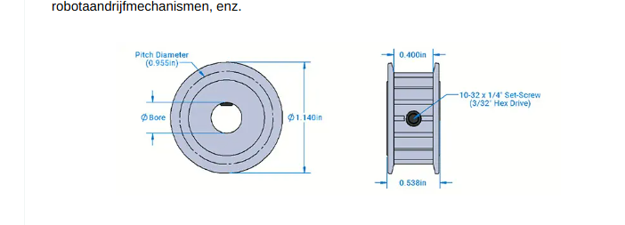

# Safe Chicks

Chicks need to be safe so make door go brrrr.

## Ideas/Notes
 - Chord attacked to door and motor winds up/down to open/close door
 - Light sensor 
 - Limit switch -> use the iCab galenus switches? -> magnetic so will not weir out I guess
 - Solar powered?
 - Controller? What I have is:
    - Pico Pi
    - Arduino
    - Raspberry pi 3
    - Beaglebone black
    - Adafruit Huzzah -> has ESP.. 
 - Camera to see if checks are there -> would need raspberry for that (arduino is too lightweight)
 - DC motor
      https://www.farnell.com/datasheets/4376711.pdf?_gl=1*1atfsg3*_gcl_au*MjAyNTY1MDc1NS4xNzQxNjI0NTgy

## Used in V2

### Mouser
426-DRI0044
Fabrik. Artikelnum.: DRI0044
DFRobot 2x1.2A DC Motor Driv / Stroombeheer IC Ontwikkelinghulpmiddelen
TARIC:8473302000 ECCN:EAR99 COO:CN

426-FIT0489-D
Fabrik. Artikelnum.: FIT0489-D
DFRobot Turbo Metal Gear Wor / DFRobo-accessoires
TARIC:8471500090 ECCN:EAR99 COO:CN

653-D2HW-C223MR
Fabrik. Artikelnum.: D2HW-C223MR
Omron Electronics Subminiature Basic S / Basis- / klikschakelaars
TARIC:8536508099 ECCN:EAR99 COO:IT

### RobotShop
RB-Jsu-84 37mm Motor Mount For Titan Series (Pair) 5-4-G 1 1 0 €5.71 €5.71
RB-Sct-941 15T Timing Pinion Pulley (6mm) 02-6-B 1 1 0 €9.45 €9.45
RB-Phi-457 Waterproof Enclosure 200x120x75 w/ Transparent Lid M05-2-D 1 1 0 €13.12 €13.12

## Usefull links
DIY chicken door:
https://davenaves.com/blog/interests-projects/chickens/chicken-coop/arduino-chicken-door/#

Battery management system
https://www.dfrobot.com/product-1714.html

Arduino low power
https://docs.arduino.cc/learn/electronics/low-power/

## Measurements

### POC Arduino Uno (17/03 16:20)
  - added 4[Ohm] resistor between 12V supply
  - Idle ~140mV => 4,9 mW
  - Run  ~1,30V => 423 mW

